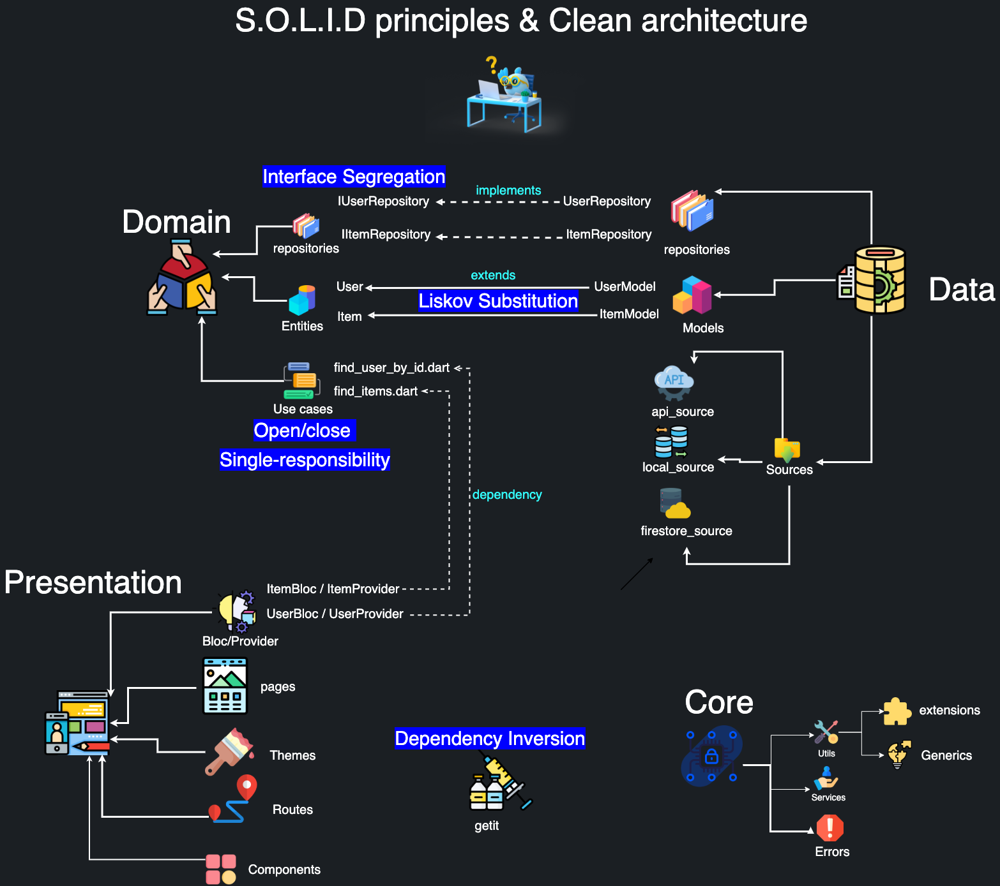

## Start the server

```
    1- Install NodeJs
    2- npm install -g json-server
    3- json-server data.json
```

## S.O.L.I.D. Principles

```
S -> Single Responsibility Principle
• A class should be responsible for one thing.
• There's a place for everything and everything is in its place.
• Find one reason to change and take everything else out of the class.
• Very precise names for many small classes > generic names for large classes.

O -> Open/Close Principle
• An entity should be open for extension, but closed for modification.
• Extend functionality by adding new code instead of changing existing code.
• Separate the behavior, so the system can easily be extended, but never broken.
• Goal: get to a point where your can never break the core of your system.

L -> Liskov Substitution Principle
• Any derived/extended class should be able to substitute its parent class without the customer knowing it.
• Every class that implements an interface, must be able to substitute any reference throughout the code that implements that same interface.
• Every part of the code should get the expected result no matter what instance of a class you send to it, given it implements the same interface.

I -> Interface Segregation Principle
• A client should never be forced to depend on method it doesn't use.
• Or, a client should never depend on anything more than the method it's calling.
• Changing one method in a class shouldn't affect classes that don't depend on it.
• Replace fat interfaces with many small, specific interfaces.

D -> Dependency Inversion Principle
• Never depends on anything concrete, only depend on abstractions.
• High level modules should not depends on low level modules. They should depends on abstractions.
• Able to change an implementation easily without altering the high level code.
```

## Don't get trapped by S.O.L.I.D.

```
• SOLID design principles are principles, not rules.
• Always use common sense when applying SOLID.
• Avoid over-fragmenting your code for the sake of SRP or SOLID.
• Don't try to achieve SOLID, use SOLID to achieve maintainability.
```


